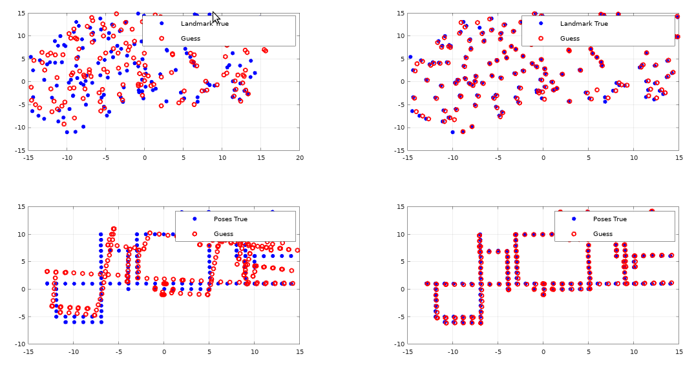
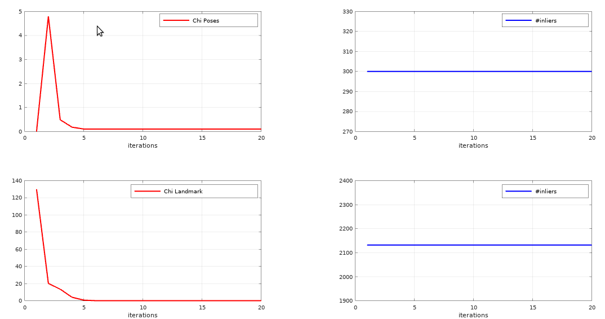
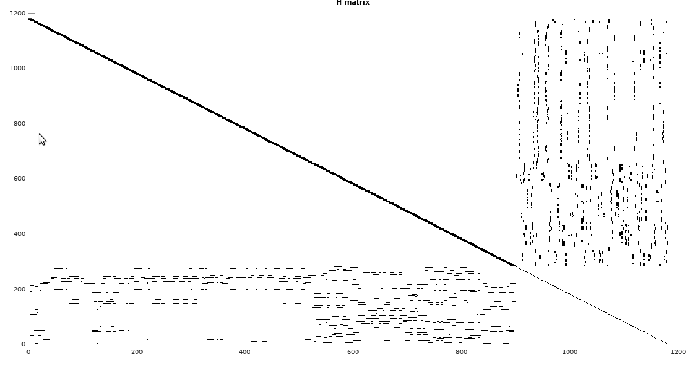

# Bearing_Only_SLAM

<mark>The project has been completed for fulfilment of credits for the *Probabilistic Robotics course* given by *Prof. Giorgio Grisetti*, A.Y. 2020-2021. </mark>

## Prerequisite

The dataset is composed by a g2o file which contain poses and bearing observations. The file contain also odometry edges that are use to construct the initial guess for the problem.

Install Octave using the following command

```
sudo apt install octave
```
## Executing the script

Run Octave and execute the following script

```
octave-cli	

Bearing_only_slam
```

## Methodology

* Parse the whole dataset and initialize the landmarks (Linear Triangulation) by using at least two bearing observations with the proper parallax i.e. condiering robot poses with heading such that the corresponding bearing measurements intersect (so neither parallel nor divergent). 

* Setup a LS optimization that involves all the poses and landmarks initialized

* In the bearing edges the ID of the landmarkd is reported, use it to identify them for both the triangulation and the global optimization

## Results

* Graph depicting Landmarks before and after optimization; Robot poses before and after optimization


* Graph depicting chi evolution of Landmarks and chi evolution of Robot poses before and after optimization; efore and after optimization


* Graph depicting H matrix structure


